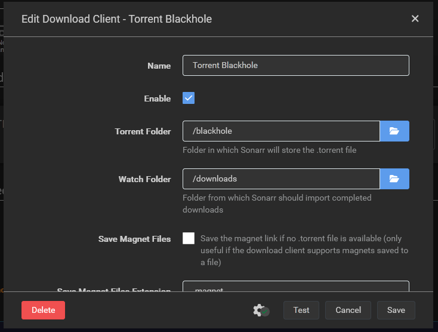
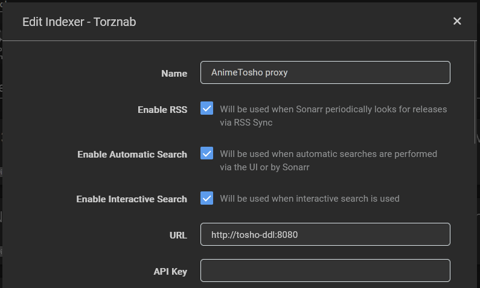
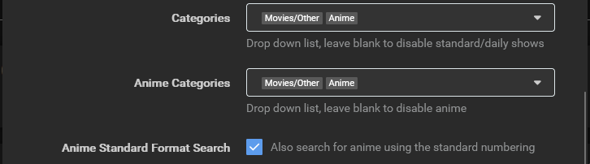
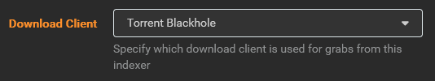

# AnimeTosho DDL Proxy
Gives Sonarr a valid Torznab feed to pick releases from, and picks up which one it chose via Torrent Blackhole. Then, downloads the release with JDownloader.

# Setup
The easiest way to set this up is through Docker, although you can also use the jars provided in the releases tab.

1. Make sure you have [Docker](https://docs.docker.com/engine/install) and [Docker Compose](https://docs.docker.com/compose/install/#scenario-two-install-the-compose-plugin).
2. Make a `docker-compose.yaml` file with these contents:
~~~yaml
services:
  toshoddl:
    container_name: toshoddl-docker
    image: ghcr.io/realsz27/toshoddl:latest
    volumes:
      - ./config/downloads:/downloads
      - ./config/blackhole:/blackhole
        
  # Thanks jlesage for making this container
  jdownloader-2:
    container_name: jdownloader-docker
    image: jlesage/jdownloader-2
    ports:
      - 5800:5800
    volumes:
      - ./config/jdownloader:/config:rw
      - ./config/downloads:/output:rw
~~~

## Setup Sonarr
1. In the `Download Clients` settings page, add a new `Torrent Blackhole` and set the `Torrent Folder` and `Watch Folder` to your blackhole and downloads folders respectively. Make sure Sonarr can access these folders, of course.

2. Next, in the `Indexers` settings page, add a new `Torznab` indexer and set the URL to `http://toshoddl:8080` and select everything available in `Categories` and `Anime Categories`.

Just to be sure, you can also set `Download Client` to the Torrent Blackhole with advanced settings turned on.

## Setup JDownloader
