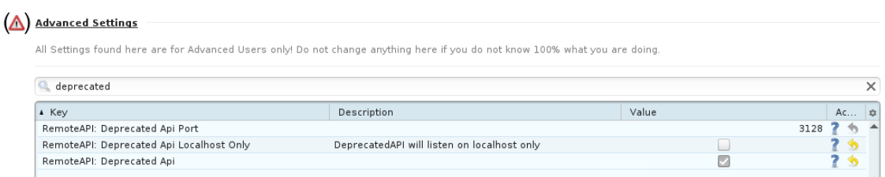

# Disclaimers
- I'm still learning! If you have any CONSTRUCTIVE feedback, please say something!
- Although I intend to maintain this app as long as I can, I have other things to keep up with.
- For now, I'm calling this a beta. It works fine for me, but there are probably dozens of bugs to fix before I can call it fully functional.

# AnimeTosho DDL Proxy
Gives Sonarr a valid Torznab feed to pick releases from, and picks up which one it chose via Torrent Blackhole. Then, downloads the release with JDownloader.

## Limitations
- Links expire quickly on AnimeTosho, so pretty much only new releases work. Unfortunately, there's nothing I can do about this.
- Links aren't checked for availability until after they are chosen. This means that sonarr might choose a release that can't be downloaded.

# Setup
The easiest way to set this up is through Docker, although you can also use the jars provided in the releases tab.

1. Make sure you have [Docker](https://docs.docker.com/engine/install) and [Docker Compose](https://docs.docker.com/compose/install/#scenario-two-install-the-compose-plugin).
2. Make a `compose.yaml` file with these contents:

> [!IMPORTANT]  
> This assumes your Sonarr instance is in the same compose file, or at least on the same docker network. If you want, you can always add 8080 as a port on the container and use normal networking.

> [!NOTE]  
> You don't have to use this container, or any container for that matter. Any JDownloader instance will work. Just make sure you have properly set `JDOWNLOADER_API_URL` and `BASE_URL` so that JDownloader can contact the app, and vice versa.

> [!NOTE]
> Byparr helps deal with hosts behind Cloudflare. It probably won't work 100% of the time, but it's the best we can do.

~~~yaml
services:
  tosho-ddl:
    container_name: tosho-ddl
    image: ghcr.io/realsz27/tosho-ddl:latest # Docker Hub mirrors are also available at sz27/tosho-ddl
    restart: unless-stopped
    environment:
      - JDOWNLOADER_API_URL: http://jdownloader-2:3128/
      - BASE_URL: http://tosho-ddl:8080/ # This is needed because sonarr needs somewhere do download the torrent from.
    volumes:
      - ./config/downloads:/downloads
      - ./config/blackhole:/blackhole
  
  jdownloader-2:
    container_name: jdownloader-docker
    image: jlesage/jdownloader-2
    restart: unless-stopped
    ports:
      - 5800:5800
    volumes:
      - ./config/jdownloader:/config:rw
      - ./config/downloads:/output:rw
  
  # Optional, only if you want hosts that are behind cloudflare.
  byparr:
    container_name: byparr
    image: ghcr.io/thephaseless/byparr:latest
    restart: unless-stopped
~~~
### Environment Variables

> [!IMPORTANT]  
> If you are using the raw .jar, the environment variables can be passed through the command line by changing them from `THIS_FORM=` to `--this.form=`.

Most of these don't need to be changed.

| Variable                   | Description                                                                                                        | Default                |
|----------------------------|--------------------------------------------------------------------------------------------------------------------|------------------------|
| JDOWNLOADER_API_URL        | The URL that the app will use to contact JDownloader.                                                              | http://localhost:3128/ |
| BASE_URL                   | The URL that the app will serve the fake .torrent file from.                                                       | http://localhost:8080/ |
| DOWNLOAD_FOLDER            | The folder where JDownloader will save the files to.                                                               | /downloads             |
| BLACKHOLE_FOLDER           | The folder the app will look for .torrent files in.                                                                | /blackhole             |
| SERVER_PORT                | The port the server will run on.                                                                                   | 8080                   |
| LOGGING_LEVEL_DEV_DDLPROXY | Log level. This is technically just a normal Spring boot variable, but it's useful so I thought I'd put it on here | INFO                   |

## Setup Sonarr

### 1. Add Torrent Blackhole

> [!NOTE]
> The torrent file that this app serves isn't real. It has totally fake files and trackers, sonarr just requires a fully formed file for some reason.

In the `Download Clients` settings page, add a new `Torrent Blackhole` and set the `Torrent Folder` and `Watch Folder` to your blackhole and downloads folders respectively. 

> [!IMPORTANT]
> Make sure the `Torrent Folder` and `Watch Folder` in Sonarr point to the appropriate directories where the app and JDownloader can interact. This is `./config/blackhole` and `./config/downloads` in the example config respectively. Remember to mount these to your sonarr container.

### 2. Add Torznab Indexer

2. Next, in the `Indexers` settings page, add a new `Torznab` indexer and set the URL to `http://tosho-ddl:8080` and select everything available in `Categories` and `Anime Categories`.

Just to be sure, you can also set `Download Client` to the Torrent Blackhole with advanced settings turned on.

> [!TIP]
> Make sure to test both of these before moving on.

## Setup JDownloader

> [!CAUTION]
> You don't need to use the provided Docker container for JDownloader. Any instance of JDownloader will work as long as it's configured right. **However**, it is recommended that you have a dedicated JDownloader instance for this app. This is because the container clears the LinkGrabber queue when checking if links are online. This might be a problem if you're using JDownloader for other tasks, especially if you have many shows airing on the same day.

In `Advanced Settings`, turn on `Deprecated Api`, off `Deprecated Api Localhost Only` and restart JDownloader.

**If** you installed byparr, go to `Connection Manager`, click add, enter `byparr` in the `Host/Port` box, and change the port to `8191`. Leave username and password blank. Then click ok.

Then move the new proxy up as shown below.

